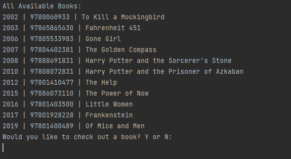
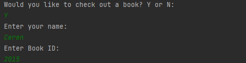
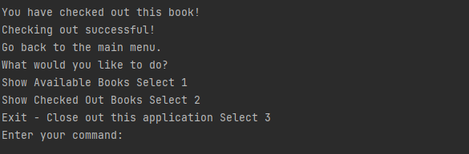

 When the user enters the program, they will be asked a series of questions:
 

if the user inputs 1, all available books will be displayed:

When the user inputs "Y" then they will be asked to give their name and book id:

Once this information is entered, the user will have checked out the book and will be directed back to the main page:

Now we will have the user check the same book back in to confirm the steps that have been accomplished and display the use of more code:

The user will input 2 in to view all checked out books:

As it is seen in the picture above, the book that was stored under Ceren is the one we checked out!

We will prompt "Y" to check the book back in.

The user will receive a message asking for book id.

The book has now been checked in and the user is redirected to the main menu.

If we select show all available books, then the book should now display the book with the id 2015:

It is a success!

The user can enter "N" to show they do not want to check out a book and be redirected to the main menu.

When the user enters "3" then the program ends.

One interesting part of the code for me is:

This part is interesting to me because it took me a long time to figure out and when I did it felt awesome. I was impressed that I was able to fit all the input into one line. 

